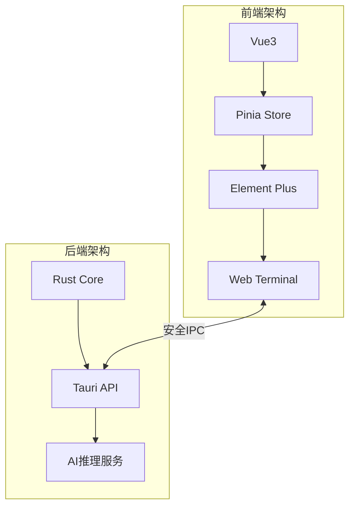
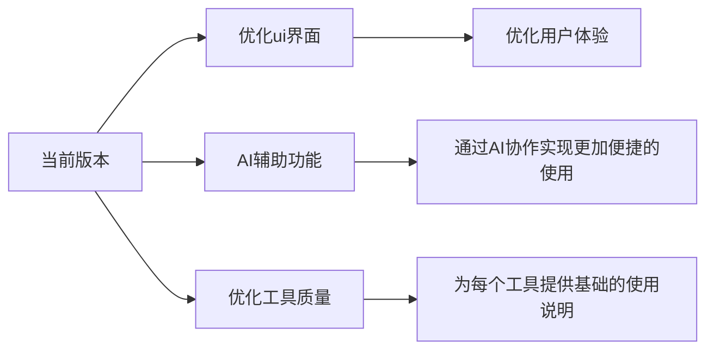

# 🛡️ Kurust - 安全研究人员的智能助手

## 一、📋 项目概述

🔧 Kurust是一款专注网络安全研究的**全栈式工具平台**，通过创新性的Tauri框架（Vue3+Rust）组合，为白帽子黑客和安全研究者提供：

- 🚀 **高性能**执行环境
- 🔄 **无缝化**工具集成
- 🧠 **智能化**安全分析

## 二、✨ 核心特性

### 1. 🧰 多类型工具集成管理

支持工具类型：

- 🖥️ CLI命令行工具
- 🎨 GUI图形工具
- ☕ JAR包应用
- 📁 目录型工具

- 🔧 智能环境配置
  - ⚙️ 自动识别Java多版本（JDK8-21）

  

### 2. 🤖 AI辅助安全分析

渗透测试武器库和应急响应工具箱分别引入了不同的AI辅助功能

#### 🔥 渗透测试武器库

- **🤖 JS代码审计**：检测XSS、CSRF等前端漏洞
- **📜 源代码审计**：识别SQL注入、路径遍历等高风险代码

#### 🚨 应急响应工具箱
- **🖥️ 进程分析**：实时监控异常进程行为
- **📊 流量分析**：精准定位C2通信与数据泄露
- **🛡️ Webshell监测**：双重验证0day Webshell
- **📦 PCAP分析**：协议还原与文件提取

### 3. 📜 智能日志系统
- 日志维度：
  - ⏱️ 精确时间戳
  - 🚨 多级告警系统
  - 📍 操作溯源追踪

### 4.  📂 配置管理

- `tools.json`（🔧 工具配置）

- `java.json`（☕️ Java环境）
- `config.toml`（🤖 AI接口）

​	可使用任意模型api或者ollama本地大模型

​	使用api时，在api_type="deepseek"即可，如果使用本地ollama模型则改为 api_type="ollama"即可

## 三、🚀 未来规划

## 加入我们！👋
📧 security@kurust.io | 🌐 www.kurust.io | 💻 GitHub:kurust-project

